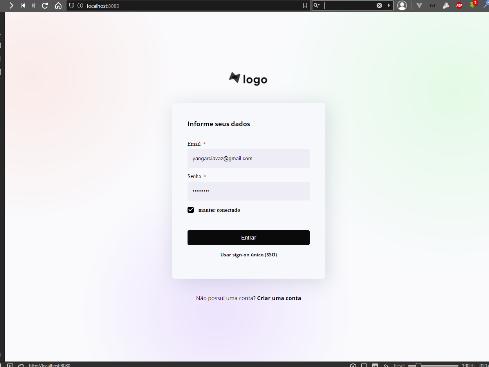
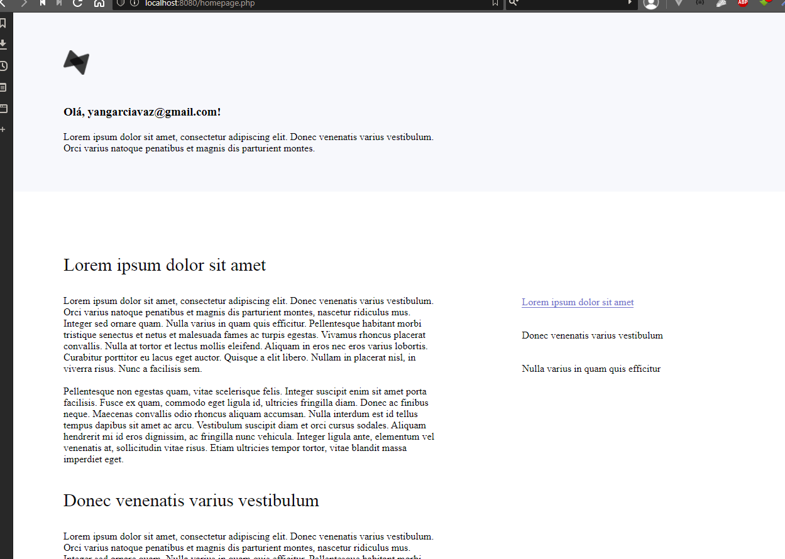

<h3 align="center">
    Página de Login <br /> <hr />
    
</h3>
<h3 align="center">
    Homepage pós login <br /> <hr />
    
</h3>

<br />

## 🔖 &nbsp; Sobre

<hr />

<h4> Um site genérico que simula uma tela de login funciona, onde envia o email do usuário entre as páginas </h4>

---

Tecnologias usadas:
<br />

- HTML, CSS, PHP, JavaScript

<hr /> <br />

## 📁 &nbsp; Como baixar o projeto

```bash

    # Clonar o repositório
    $ git clone https://github.com/yangvaz/notas-dEsafio

    # Entrar no diretório
    $ cd notas-dEsafio

    # Iniciar o servidor e acessar pelo caminho abaixo
    $ php -S localhost:8080

```

---

Desenvolvido por Yan Garcia 🥑
